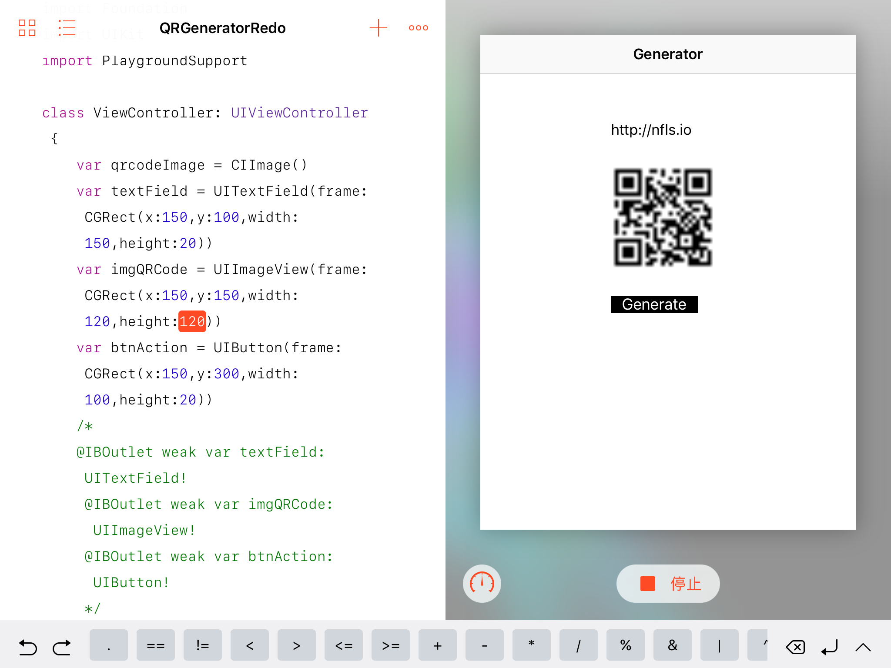
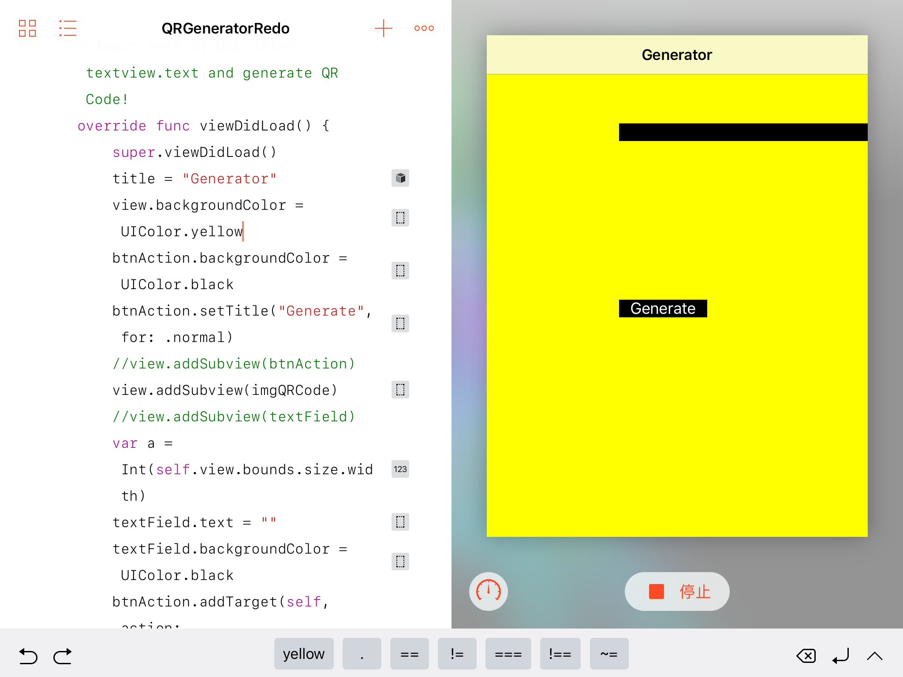

# QRCodeGenerator
高中黑历史存档：用swift写的一个简单（lou）的二维码生成器，可在iPad端Swift Playground内运行
ARCHIVE ONLY: an extremely simple and amateur QR code generator written in Swift. Works on Swift Playground on iPad.
## 截图 Screenshots

